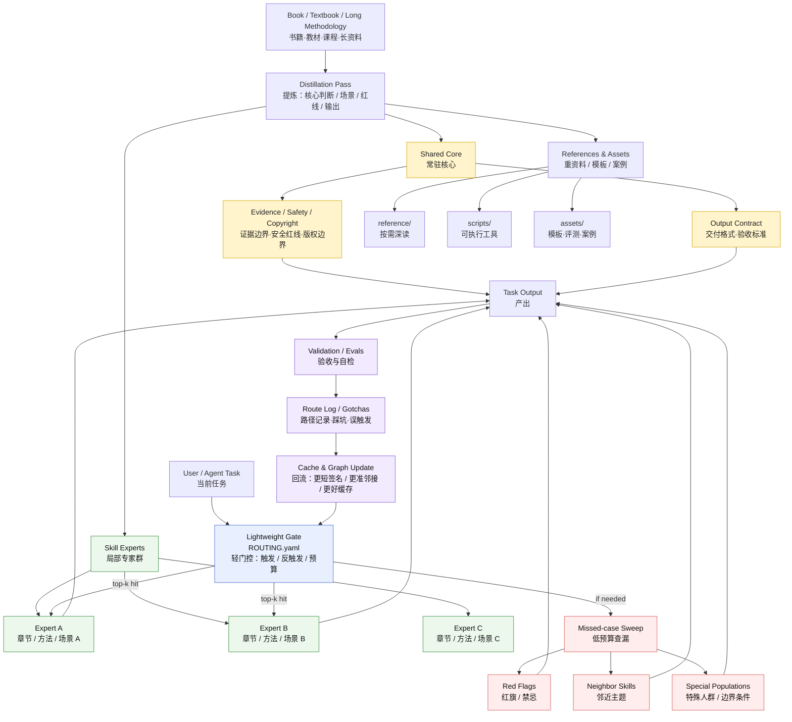

# Sparse Book-to-Skill Distillation — Structure Diagram

This diagram shows how a long source such as a book, textbook, course, or project methodology is distilled into a sparse, callable Skill system.



## One-line model

```text
Book
  -> shared core + routed experts + heavy references
  -> lightweight gate
  -> top-k activation + missed-case sweep
  -> output + validation
  -> route log / gotcha / eval feedback
  -> better cache hit next time
```

## Chinese shorthand

> 先炼核心，再分专家；先中主脉，再扫旁枝；预算分层，重料后置；路由留痕，越用越准。

> 网给 Skill 以通达，环给 Skill 以低功耗；分支出去，回流成丹。
