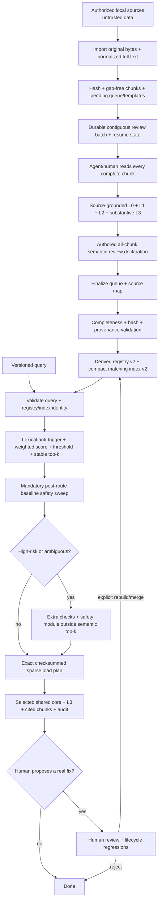

# Sparse Book-to-Skill Distillation — structure

The canonical Mermaid source is `assets/structure-diagram.mmd`. It separates the agent-reviewed full pass from repeated sparse reading, makes registry/index derivation explicit, and makes the post-route baseline safety sweep unconditional.

## Normative reading

- Phase 1 imports every declared supported source and covers every normalized-text line exactly once.
- Deterministic code creates queue/templates but does not author semantic knowledge.
- An agent/human reads every complete chunk and writes source-grounded L0–L3 or a reviewed no-reusable reason.
- Build is reachable only after complete hash/coverage/provenance/L3/shared-core validation.
- Registry and compact index are derived together and cross-validated at query time.
- The lexical gate is deterministic index matching, not semantic AI.
- Every contract-valid selected, no-hit, bypassed, or rejected route reaches the baseline post-route sweep.
- High-risk/ambiguous extra checks and safety L3 are outside semantic top-k.
- The final plan contains only exact selected/safety L3 plus cited chunks, with checksums and audit events.
- Feedback cannot mutate or merge artifacts until a human reviews and lifecycle regressions pass.

Run `python3 scripts/run_lifecycle_demo.py` for the synthetic source-to-query trace.
